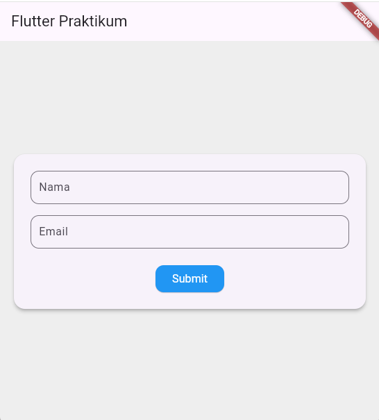
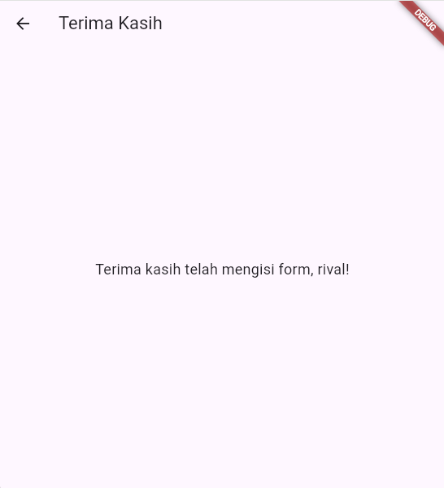

# 📱 Flutter Praktikum - UTS Mobile Programming

Proyek ini dibuat untuk memenuhi Ujian Tengah Semester (UTS) mata kuliah **Pemrograman untuk Perangkat Bergerak** oleh Marwanto Rahmatuloh, ST., MT. di Program Studi D3 Teknik Informatika, ULBI.

## Identitas 

Nama: Rival Rudiana Putra
Npm: 613230041
Prodi: D3 Teknik Informatika

## ✨ Fitur Aplikasi

- Form dengan input nama dan email.
- Validasi input:
  - Nama dan email tidak boleh kosong.
  - Email harus memiliki format yang valid (`@` dan `.` wajib ada).
  - Jika input tidak valid, pesan error muncul di bawah TextField terkait.
- Dialog konfirmasi setelah tombol Submit ditekan.
- Navigasi ke halaman "Terima Kasih" setelah dialog ditutup.
- Transisi halaman dengan animasi **slide + fade** (halus).
- Layout responsif:
  - Tampilan satu kolom untuk perangkat mobile.
  - Tampilan dua kolom berdampingan untuk perangkat tablet.
- Desain modern:
  - Border radius pada form dan tombol.
  - Warna latar belakang yang lembut.
  - Ukuran font yang nyaman dibaca.

## 📷 Tampilan

Berikut adalah beberapa tampilan dari aplikasi ini:





## 🚀 Cara Menjalankan

1. Pastikan Flutter SDK sudah terinstal.
2. Clone atau salin seluruh project ini ke dalam folder.
3. Jalankan perintah berikut di terminal:
   ```bash
   flutter pub get
   flutter run
