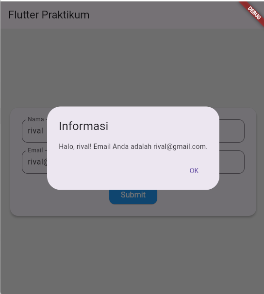

# 📱 Flutter Praktikum - UTS Mobile Programming

Proyek ini dibuat untuk memenuhi Ujian Tengah Semester (UTS) mata kuliah **Pemrograman untuk Perangkat Bergerak** oleh Marwanto Rahmatuloh, ST., MT. di Program Studi D3 Teknik Informatika, ULBI.

## Identitas 

- Nama: Rival Rudiana Putra
- Npm: 613230041
- Prodi: D3 Teknik Informatika

## ✨ Fitur Aplikasi

- Form dengan input nama dan email.
- Validasi input:
  - Nama dan email tidak boleh kosong.
  - Email harus memiliki format yang valid (`@` dan `.` wajib ada).
  - Jika input tidak valid, pesan error muncul di bawah TextField terkait.
- Dialog konfirmasi setelah tombol Submit ditekan.
- Navigasi ke halaman "Terima Kasih" setelah dialog ditutup.
- Transisi halaman dengan animasi **slide + fade**.
- Layout responsif:
  - Tampilan satu kolom untuk perangkat mobile.
  - Tampilan dua kolom berdampingan untuk perangkat tablet.
- Desain modern:
  - Border radius pada form dan tombol.
  - Warna latar belakang yang lembut.
  - Ukuran font yang nyaman dibaca.

## 📷 Tampilan

Berikut adalah beberapa tampilan dari aplikasi ini:

1. **Halaman Utama**  
   

2. **Alert**  
   

3. **Halaman Terima Kasih**  
   

## 🚀 Cara Menjalankan

1. Pastikan Flutter SDK sudah terinstal.
2. Clone repository ini ke dalam folder lokal menggunakan SSH:
   ```bash
   git clone git@github.com:rivalrudiana1/ATS-MP.git
   cd ATS-MP

3. Jalankan perintah berikut di terminal:
   ```bash
   flutter pub get
   flutter run 
4. Bisa juga dijalankan dengan F5
